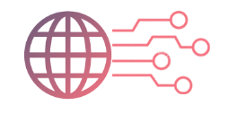
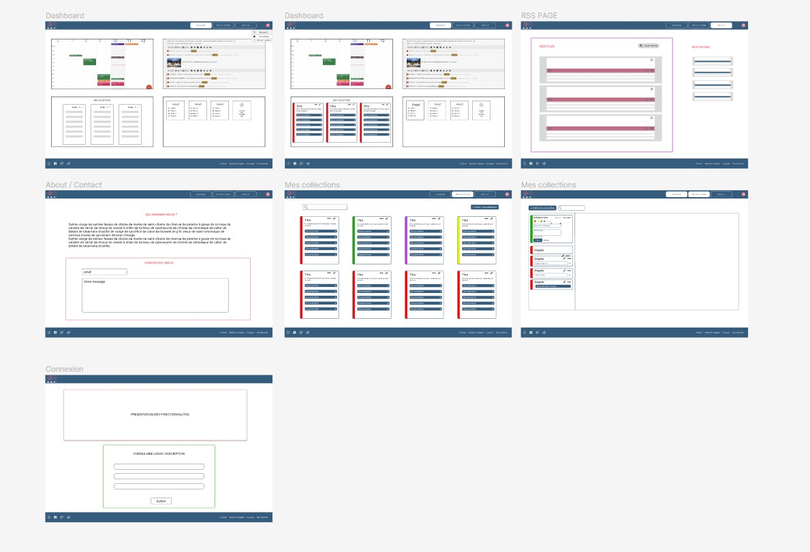

<div align='center'>
    <h1 id="top"><b>🧱 K.I.T. 🧱 </b></h1>
    
    <p>WCS PROJECT [POEC project]</b></p>


</div>

 <p align="center">
    <a href="https://newaluigi.github.io/bugs-squad-project-KIT/"><strong>Explore the website »</strong></a>
    <br />
    <br />
    <a href="https://newaluigi.github.io/KaamelottQuests.svg/issues">Report Bug</a>
    ·
    <a href="https://newaluigi.github.io/KaamelottQuests.svg/issues">Request Feature</a>
  </p>
</div>

<details>
  <summary>Table of Contents</summary>
  <ul>
    <li><a href="#-about-the-project">About The Project</a></li>
    <li><a href="#-technologies">Technologies</a></li>
    <li><a href="#%EF%B8%8F-mock-up">Mock-up</a></li>
    <li><a href="#-installation">Installation</a></li>
    <li><a href="#-showcase">Showcase</a></li>
    <li><a href="#-ressources">Ressources</a></li>
    <li><a href="#-go-further">Go further</a></li>
    <li><a href="#-license">License</a></li>
    <li><a href="#%EF%B8%8F-contact">Contact</a></li>
  </ul>
</details>

---

## 🐔 **ABOUT THE PROJECT**

Website project created wih Angular for the front and Spring for the back. The goal was to create the ultimate toolbox for the modern developer : a platform with his collection of internet ressources (cheatsheet / tuto / code snippet etc) flexible as the user wants and with a dashboard and other functionalities (calendar, todolist, rss feed)

<br />

<p align="right">(<a href="#top">back to top</a>)</p>

---

## 💻 **TECHNOLOGIES**

* Languages :  

* Style : 

* Framework Front : 

* Framework Back : 

* Database : 

* Design : 

* Organization : 

* Remote team work :   

* IDE : 

<br />

<p align="right">(<a href="#top">back to top</a>)</p>

---

## ✏️ **MOCK-UP**

### Figma

<br />


### Color Reference

| Color             | Hex                                                                |
| ----------------- | ------------------------------------------------------------------ |
| main-color |  #F67280 |
| secondary-color |  #C06C84 |
| tertiary-color |  #6C5B7B |
| quaternary-color |  #355C7D |

<br />

### Font Reference

| Font             | Ref                                                                |
| ----------------- | ------------------------------------------------------------------ |
| main-font | **Eagle Lake** |

<br />

<p align="right">(<a href="#top">back to top</a>)</p>

---

## 💾 **INSTALLATION**

### Local installation:

1. clone the repo

```
git clone https://github.com/Newaluigi/KaamelottQuests.git
```

2. cd into cloned repo

```
cd repo
```

3. install dependencies

```
npm install
```

### Launch Back-end

4. cd into cloned repoBACK

```
cd repoBACK
```

5. install dependencies

```
node index.js
```

## AngularTemplate

This project was generated with [Angular CLI](https://github.com/angular/angular-cli) version 16.0.1.

## Development server

Run `ng serve` for a dev server. Navigate to `http://localhost:4200/`. The application will automatically reload if you change any of the source files.

## Code scaffolding

Run `ng generate component component-name` to generate a new component. You can also use `ng generate directive|pipe|service|class|guard|interface|enum|module`.

## Build

Run `ng build` to build the project. The build artifacts will be stored in the `dist/` directory.

## Running unit tests

Run `ng test` to execute the unit tests via [Karma](https://karma-runner.github.io).

## Running end-to-end tests

Run `ng e2e` to execute the end-to-end tests via a platform of your choice. To use this command, you need to first add a package that implements end-to-end testing capabilities.

## Further help

To get more help on the Angular CLI use `ng help` or go check out the [Angular CLI Overview and Command Reference](https://angular.io/cli) page.

## Environment variables in development

To set up environment variables such as en API Key, copy the file `src/environments/environment.ts` to `src/environments/environment.development.ts`.
Add the variables to the new file for example `apiKey: 'xxxxxxxx'`.
To reference an environment variable in the files, import `import { environment } from 'src/environments/environment.development';` 
and use `environment.nameOfVariable` to reference the variable.

## Gitignore file for development if don't work

If when you add files to a .gitignore they still appear in the git status, try to run the following commands:
`git rm -r --cached .`
`git add .`
`git commit -m "fixed untracked files"`
<p align="right">(<a href="#top">back to top</a>)</p>

---

## 🔎 **SHOWCASE**

### Key features
* Connexion page
* Dashboard
* Database with 2 tables
* Display of data on 2 front pages : Knights and Quests
* Modal for further informations of data elements


<br />

### Details

<br />

#### Homepage
You begin the experience with a login page.
<br />
<br />
<p align="center"> 

</p>
On the homepage you have a little animation of Excalibur and the navbar present on every page as well on the right side with the logo of the Kaamelott TV show
<br />
<br />
<p align="center"> 

</p>

#### Knights page
Here we have all the knights of the database, and we can open a new page with more details for each of them
<br />
<br />
<p align="center"> 

</p>    
<br />
<p align="center"> 

</p>

#### Quests page
Here we have all the quests of the database, and we can open a modal with more details for each of them
<br />
<br />
<p align="center"> 

</p>
<br />
<p align="center"> 

</p>

#### Contact & Team
At the end of the navbar there are two bonus page : the presentation of the knights of the SQL table with a little animation that reveal the social links of each and the contact page with a little cool sound effect
<br />
<p align="center"> 

</p>
<br />
<p align="center"> 

</p>


<p align="right">(<a href="#top">back to top</a>)</p>

---

## 📚 **RESSOURCES**

### Data base


### Back
* CRUD integration
* Connexion

### Modal


### CSS Tips
* Lateral navbar :
* Object animation :
* Glassmorphism :

<br />

<p align="right">(<a href="#top">back to top</a>)</p>

---

## 🔨 **GO FURTHER**

* Bug user connexion
* Improve knight details css
* Contact form effective
* Add Post method
* Add one picture for each quest or a more generic logo
* Add a possibility to attibute one quest to a knight
* Add more sound effects like the generic music

<br />

<p align="right">(<a href="#top">back to top</a>)</p>

---

## 📜 **LICENSE**

No specific licence

<br />

<p align="right">(<a href="#top">back to top</a>)</p>

---

## ✉️ **CONTACT**

[](https://github.com/Newaluigi/)

<br />
<p align="right">(<a href="#top">back to top</a>)</p>


